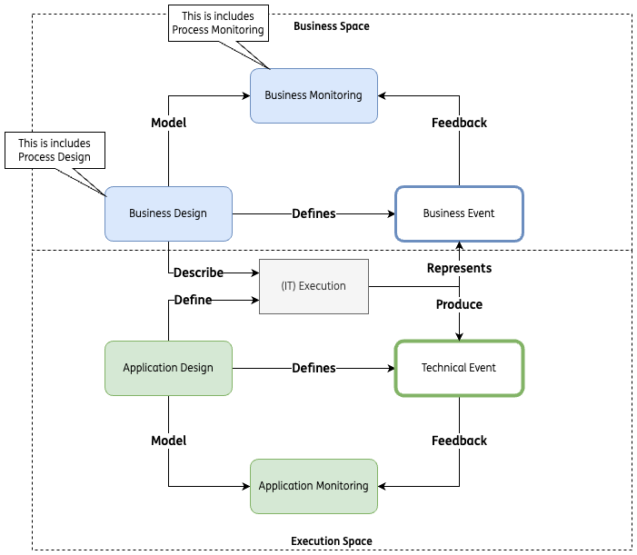

# Techincal Event Model (TEM) Specification

## Introduction 

In today's complex distributed systems, understanding what's happening across multiple services, processes, and business workflows has become increasingly challenging. The *Technical Event Model* emerges as a crucial architectural pattern that addresses this challenge by providing a standardized framework for representing and tracking all significant occurrences within a system.

This specification defines the Technical Event Model (TEM), a standardized framework for event representation, processing, and analysis in distributed systems. The TEM establishes consistent patterns for event communication, enabling comprehensive system observability, process tracking, and performance analysis.

The Technical Event Model enables complete visibility into distributed system operations through standardized event structures. This observability encompasses both technical operations and business processes, providing a foundation for:
- Distributed tracing
- Abalysis capabilities
- Standardization
- Scalability

### Distributed Tracing

Event correlation across distributed services enables end-to-end transaction tracking. This capability provides complete visibility into request flows, service dependencies, and processing paths through complex distributed architectures.

- **State Tracking**: Continuous monitoring of system state changes through event sequences ensures accurate system state reconstruction. This tracking enables reliable debugging, audit processes, and system behavior analysis.

- **Performance Monitoring**: Standardized performance metric collection across system components enables comprehensive performance analysis. This monitoring includes latency measurements, resource utilization tracking, and service level agreement verification.

- **Process Management**
The model implements hierarchical process tracking through standardized identifiers and relationships:

  - **Process Hierarchy**: Clearly defined relationships between origin, parent, and current processes enable accurate tracking of process execution chains. This hierarchy supports both synchronous and asynchronous processing patterns.
  - **Transaction Correlation**: Consistent correlation mechanisms link related events across distributed processes. This correlation enables reconstruction of complete transaction flows and process relationships.
  - **State Management**: Explicit state transition tracking through events enables accurate process state management. This capability supports both technical and business process state tracking.

### Analysis Capabilities

The event model supports comprehensive analysis across multiple dimensions:

- **Technical Analysis**: Standardized event structures enable detailed technical analysis of system behavior, performance patterns, and resource utilization. This analysis supports optimization, capacity planning, and problem resolution.
- **Business Analysis**: Business process visibility through technical events enables analysis of business operations, transaction patterns, and process effectiveness. This capability bridges technical operations and business processes.
- **Compliance Verification**: Complete event tracking supports automated compliance verification and audit processes. This verification includes both technical compliance and business rule adherence.

### Standardization

The Technical Event Model provides:

- **Consistent Processing**: Standardized event structures ensure uniform processing across system components. This consistency reduces integration complexity and improves system reliability.
- **Clear Interfaces**: Well-defined event formats and processing requirements enable clear service interfaces. This clarity simplifies system integration and reduces development complexity.
- **Verifiable Compliance**: Standard event structures support automated validation and compliance verification. This capability ensures consistent event quality across the system.

### Scalability

The model supports system growth through:

- **Volume Management**: Efficient event structures and processing patterns enable handling of increasing event volumes. This efficiency supports system growth without proportional complexity increase.
- **Component Independence**: Standardized interfaces enable independent scaling of system components. This independence supports flexible system evolution and resource optimization.

### Maintainability

The specification ensures sustainable system evolution through:

- **Version Control**: Clear versioning requirements enable controlled evolution of event definitions. This control ensures backward compatibility and smooth system updates.
- **Documentation**: Comprehensive specification of event structures and processing requirements provides clear implementation guidance. This documentation supports consistent system development and maintenance.
- **Technical Requirements**: The Technical Event Model implements these capabilities through specific requirements in:
  - **Event Structure**: Detailed specification of event formats, required attributes, and data types.
  - **Processing Rules**: Clear definition of event processing requirements, validation rules, and handling procedures.
  - **Integration Patterns**: Specification of integration requirements, protocol standards, and interface definitions.

This specification provides the technical foundation for implementing these capabilities while ensuring system scalability, reliability, and maintainability.

## Event model

### What is an Event?

An *Event* is a message which contains or depict something that occurs.  

In general it helps to decouple processes and systems by providing an asynchronous and data driven integration, providing a loosely 
coupled and more flexible architecture, where an evolving and heterogeneous technical landscape
landscape does not inhibit to achieve responsiveness and integration.

### Business vs System Events ### 

Events can be splitted into two macro categories (ref: RA Business Event Categories Endorsed v02): 

| Event Cathegory | Definition                 | 
| --------------- | -------------------------- |
| Business Event  | A business event is an identifiable, significant happening in a business scenario; *Business events* which are related to business processes and are triggered by business operations. These events are used to track the progress of business processes, and to provide insights into the performance of business operations | 
| System Event    | A system event tracks a point in the execution of a program at which an identifiable computing task takes place |

The following picture depicts how the two event categories belongs to different cathegories:



In particular we are going to focus on a subcategory of System Events: the *System Process Events*.

#### System Process Events

This kind of events enables the inter-processes conversation patterns and they can be seen as an API endpoint, in a parallel with the HTTP/Rest 
communication

### Synchronous vs. Asynchronous Interaction

Before exploring the it's essential to understand the fundamental paradigms of intercomponent communication: System Process Event Data Model 
synchronous and asynchronous interactions. 

This understanding forms the foundation upon which the Event Data Model is built. 

#### Synchronous Interaction

In synchronous communication, which occurs typically via microservices, the sender waits for the receiver's response before proceeding. This creates 
a direct, real-time interaction.

Pros:
- Immediate feedback
- Easier to manage and reason about
- Simplifies error handling
- Optimized for low latency interaction

Cons:
- Can lead to blocking and reduced performance
- Limited scalability
- Potentials for timeouts in log running operations

#### Asynchronous Interaction

In asynchronous communication, which occurs works by message exchange between components, the sender doesn't wait for the receiver response 
and can continue processing other tasks.

Pros:
- Improved performance and responsiveness
- Better scalability
- Supports log-running operations without blocking

Cons:
- More complex to implement and reason about
- Require additional 
- Requires additional mechanisms for error handling and state management

## System Process Event Model Specification

The System Process Event Data Model provides a standardized framework for event representation in distributed systems. It enables comprehensive tracing, state management, and process correlation across distributed services. 

System process events are categorized as:

| Event Cathegory | Usage | Definition |
|-----------------|-------|------------|
| Request         | <ul><li>Requires response</li><li>Initiates operations</li><li>Must include replyTo topic</li><li>Requires correlationID</li></ul> | Any *System Event* that delivers a request execution command; a request is always tied to a Response or a set of possible Responses |
| Response        | <ul><li>Always relates to a request</li><li>Must include original correlationID</li><li>Contains operation results</li><li>May include status information</li></ul> | Any *System Event* that delivers a reply to an execution command request; a response is always associated to a Request |
| Notification    | <ul><li>Informs about system state changes</li><li>Includes acknowledgments</li><li>One-way event communication </li><li>One-way event communication </li><li>No response expected</li></ul> | Any *System Event* that delivers a status information from one system component to another, without expecting and response or Reply. |

Tecnical events are structured as:
 -  *Headers*: a set of *key-value* pair of *headers*.
    
    The headers are classified in 3 cathegories:
    - General headers
    - Context 
    - Operation
    
 -  *Payload*: the payload, contains the business data defined by the user; the *raccomanded* format is the *Apache AVRO binary* format for its efficient representation

(todo - Add diagram)

### Event Headers specification

This section defines the event section.

| Field Category | Header Field          | Type       | Required | Description                                                                               | Pattern/Format                                          |  
|----------------|-----------------------|------------|----------|-------------------------------------------------------------------------------------------|---------------------------------------------------------|
| General        | id                    | string     | Yes      | Unique message identifier                                                                 | User defined unique identifier                          |
| General        | sentTimestamp         | string     | Yes      | Event production timestamp                                                                | Examples: `2024-12-20T12:30:22Z`, `2024-12-20T12:30:22.123Z`; UTC timestamp in ISO 8601 format. Always includes timezone marker 'Z'. Milliseconds are optional. pattern: ^\d{4}-(?:0[1-9]|1[0-2])-(?:0[1-9]|[12]\d|3[01])T(?:[01]\d|2[0-3]):[0-5]\d:[0-5]\d(?:\.\d{1,3})?Z$ | 
| General        | createTimestamp       | string     | No       | Optional event creation timestamp                                                         | Examples: `2024-12-20T12:30:22Z`, `2024-12-20T12:30:22.123Z`; UTC timestamp in ISO 8601 format. Always includes timezone marker 'Z'. Milliseconds are optional. pattern: ^\d{4}-(?:0[1-9]|1[0-2])-(?:0[1-9]|[12]\d|3[01])T(?:[01]\d|2[0-3]):[0-5]\d:[0-5]\d(?:\.\d{1,3})?Z$ |
| General        | expirationTimestamp   | string     | No       | Processing timeout                                                                        | Examples: `2024-12-20T12:30:22Z`, `2024-12-20T12:30:22.123Z`; UTC timestamp in ISO 8601 format. Always includes timezone marker 'Z'. Milliseconds are optional. pattern: ^\d{4}-(?:0[1-9]|1[0-2])-(?:0[1-9]|[12]\d|3[01])T(?:[01]\d|2[0-3]):[0-5]\d:[0-5]\d(?:\.\d{1,3})?Z$ |
| Context        | originProcessId       | string     | Yes      | Original *Process Identifier*                                                             | ProcessId: Domain.API.Service.processID; pattern: `^[a-zA-Z0-9-_]+(\.[a-zA-Z0-9-_]+){3}$`                 |  
| Context        | currentProcessId      | string     | Yes      | Current *process identifier*                                                              | ProcessId: Domain.API.Service.processID; pattern: `^[a-zA-Z0-9-_]+(\.[a-zA-Z0-9-_]+){3}$`                 |
| Context        | parentProcessId       | string     | No       | Parent *process identifier*                                                               | ProcessId: Domain.API.Service.processID; pattern: `^[a-zA-Z0-9-_]+(\.[a-zA-Z0-9-_]+){3}$`                 |
| Context        | sessionType           | string     | Yes      | Session origin type                                                                       | `AT` (AccessToken) *or* `BT` (BatchToken) *or* `ET` (BatchToken) |
| Context        | sessionId             | string     | Yes      | Session identifier                                                                        | UUID format                                             |
| Context        | sessionSequenceNumber | integer    | No       | Incremental message counter within session                                                | Integer                                                 |
| Operation      | eventType             | string     | Yes      | Event operation type                                                                      | `NTFCTN` (Notification) *or* `RQST` (Request) *or* `RSPNS` (Response) |  | 
| Operation      | eventName             | string     | Yes      | Specific event name identifier                                                            | For instance: `ExecutePaymentResponse`, `StateUpdateNotification`, `CloseAccountResponse` |
| Operation      | eventVersion          | string     | Yes      | Event schema version                                                                      | Semantic versioning                                     |  
| Operation      | replyTo               | string     | No*      | Reply topic for responses; required if a if `eventType` is `RQST`                         | Queue or Topic name                                            |  
| Operation      | correlationID         | string     | No*      | Request-response correlation identifier; required if a if `eventType` is `RQST` or `RSPS` | UUID format                                             |
| Operation      | repostOf              | string     | No*      | Original message unique identifier for retries                                            | UUID format                                             |
| Operation      | repostCount           | integer    | No*      | Retry attempt counter; required if `repostOf` is defined                                  | Integer                                                 |
| Operation      | forwardTo             | string     | No       | Forward-to topic                                                                          | Queue or Topic name                                            |  

#### Message Identifiers

Message identification is crucial for tracking, debugging, and ensuring proper message handling across distributed systems. Each message must have a unique identifier that distinguishes it from all other messages in the system.

##### Uniqueness Requirements

- **Global Uniqueness**:
    Each message ID MUST be unique across the entire distributed system
    The uniqueness MUST span across all time periods (both historical and future messages)
    The uniqueness MUST be maintained across all components, services, and processes
    Developers are responsible for ensuring global uniqueness across the system
- **Implementation Responsibility**:
    While UUID (Universally Unique Identifier) can be used, it is not mandated
    The choice of ID generation strategy is left to the implementation
    Developers MUST ensure their chosen strategy guarantees uniqueness
    The implementing system is fully responsible for preventing ID collisions

##### Message ID References

Message IDs serve as reference points for various system operations:

- **Reposting Scenarios**:
    - Original message ID is referenced in the repostOf header
    - Enables tracking of message retry chains
    - Helps prevent duplicate processing

- **Message Routing**:
    - Message IDs can be used in routing decisions
    - Enables message tracking across system components
    - Supports audit trail creation

##### Implementation Guidelines

- **Generation Requirements**:
    - Message IDs MUST be generated at message creation time
    - The generating component is responsible for ensuring uniqueness
    - IDs MUST NOT be reused, even for identical message content
- **Format Requirements**:
    - Maximum length: 128 characters
    - Allowed characters: alphanumeric, hyphens, and underscores
    - Pattern: ^[a-zA-Z0-9][a-zA-Z0-9-_]*$

##### Validation Rules

- System Requirements
    - Systems MUST validate message ID uniqueness
    - Duplicate IDs MUST be rejected
    - Invalid format IDs MUST be rejected
- Error Handling
    - Duplicate ID detection must trigger appropriate error responses
    - Systems should log ID validation failures
    - Clear error messages should indicate the nature of ID-related failures

#### Process Identifiers

Process IDs follow a hierarchical structure with four components:
1. BUSINESS_DOMAIN
2. ORIGINATING_API
3. ORIGINATING_SERVICE
4. ORIGINATING_PROCESS_ID

Pattern: `^[a-zA-Z0-9-_]+(\.[a-zA-Z0-9-_]+){3}$`
Example: `Payments.ItaPaymentAPI.ExecutePayment.d9639f18-faca-48a7-8701-759511bb07a7`

```platUML
@startuml Event Communication Patterns

participant "Service A" as A
participant "Message Broker" as MB
participant "Service B" as B

' Request-Response Pattern
group Request-Response
    A -> MB: Request Event\n(eventType=RQST, correlationId=123,\nreplyTo=serviceA.responses)
    activate A
    MB -> B: Forward Request
    activate B
    B -> MB: Response Event\n(eventType=RSPNS, correlationId=123)
    deactivate B
    MB -> A: Forward Response
    deactivate A
end

' Notification Pattern
group Notification
    B -> MB: Notification Event\n(eventType=NTFCTN)
    MB -> A: Forward Notification
    note right: No response expected
end

@enduml
```

#### Date and time fields
(todo)

#### Session handling
(todo)

#### Event payload identification
(todo)

#### Resquest-Response headers
(todo)

#### Routing headers

(todo)

### Event payload specification

(todo)

## Example scenarions


1. **Repost Mechanism**
   - Uses repostOf to reference original message
   - Incremental repostCount
   - Maintains original correlationID

2. **Timeout Handling**
   - Explicit expirationTimestamp
   - Services must respect timeout values
   - Expired messages should be rejected

## Best Practices

1. **Process ID Management**
   - Maintain hierarchy consistency
   - Preserve origin process information
   - Use meaningful service names

2. **Session Handling**
   - Maintain session consistency
   - Increment sequence numbers
   - Use appropriate session type

3. **Correlation**
   - Always set correlationID for requests
   - Preserve correlationID in responses
   - Include replyTo for async operations

4. **Versioning**
   - Use semantic versioning
   - Include version in all messages
   - Maintain backward compatibility

## Implementation Guidelines

1. **Message Processing**
   - Validate all required fields
   - Check field formats and patterns
   - Respect processing timeouts
   - Handle retries appropriately

2. **Error Scenarios**
   - Invalid message format
   - Missing required fields
   - Expired messages
   - Invalid process IDs

3. **Performance Considerations**
   - Minimize header size
   - Optimize UUID generation
   - Efficient timestamp handling
   - Proper session management
